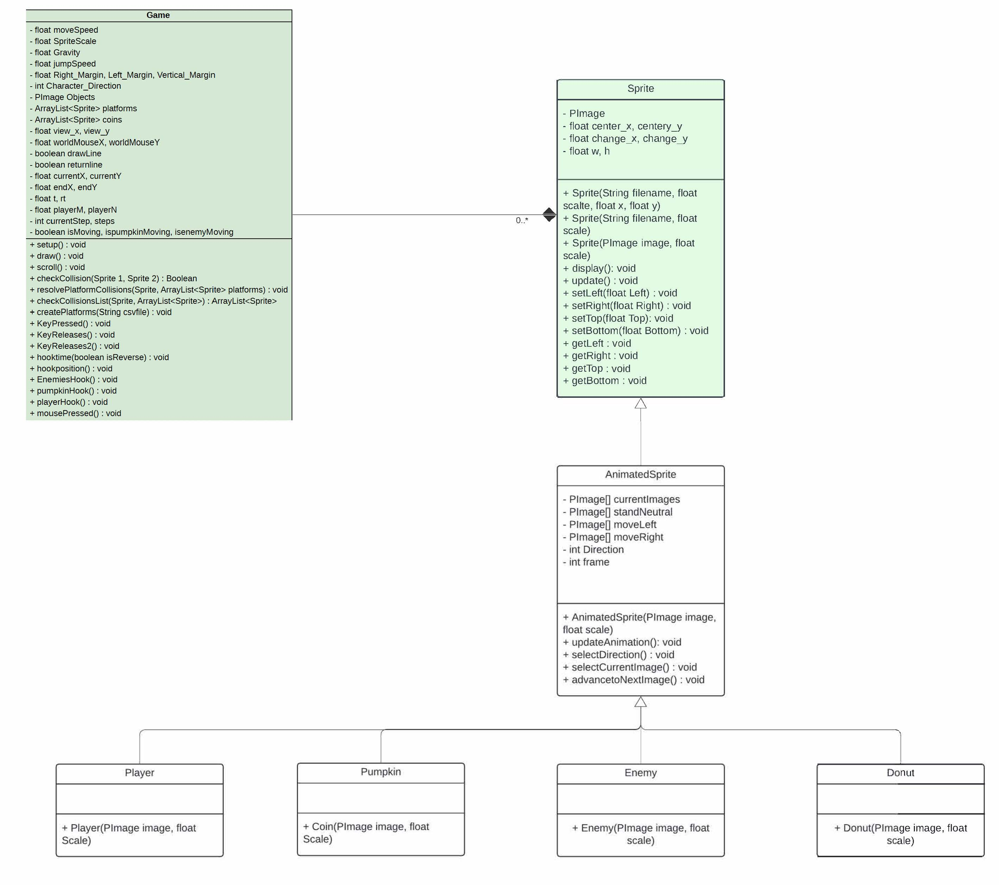
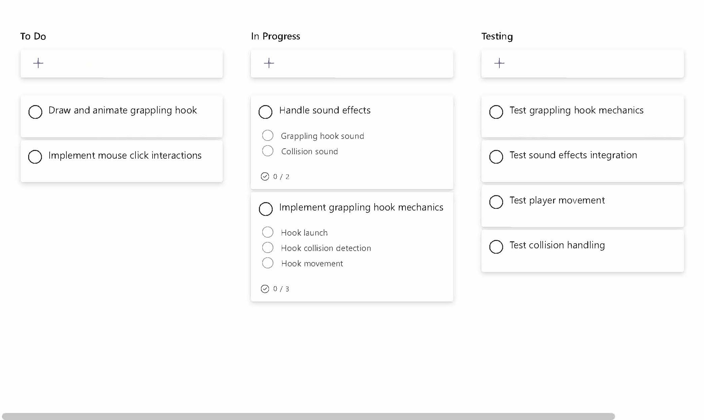

<p align="center">
 
</p>

<p align="center">
  <a href="https://youtu.be/q2mqtx54D-A">Click Here to Watch A Demo Video</a>
</p>


## Table of Contents
- [How to Donwload and Play](#how-to-download--halloween-adventure)
- [Introduction](#introduction)
- [Requirements](#requirements)
- [Design](#design)
- [Implementation](#implementation)
- [Evaluation](#evaluation)
- [Process](#process)
- [Conclusion](#conclusion)


# How to download  Halloween Adventure 


**requirements:**
MAC OS / WINDOWS, **Halloween adventure will not work on linux machines**
Processing, which can be downlaoded here: 
https://processing.org/download

1. **Donwload the zipped folder of this repo**


2. **Open Processing from your Mac OS or windows computer**

3. **Click on File - > Open**
   


4. **Select the "Game.pde" File**


5.**Once the file is open, click on the Play Button on the bottom Left corner of Processing**


6. **HAVE FUN**

# Introduction

The feature of my new level is that the character has a hook, which can have different interactive effects with the walls, enemies, and objects in the map.

I mainly designed a new function, the hook launch system. This system includes the hook launch animation and the hook collision animation. To this end, I also introduced three new collision detection algorithms, which handle the following situations respectively:

1.Colliding with a wall: When the hook hits the wall, the character will move to the collision point on the wall.

<p align="center">
 <video width="640" height="480" controls>
  <source src="./assets/2024-07-28 17.18.13.mov" type="video/mp4">
  Your browser does not support the HTML5 video tag.
</video>

</p>

2.Colliding with an object: When the hook collides with an object, the object will be hooked and move toward the character.

<p align="center">
 <video width="640" height="480" controls>
  <source src="./assets/2024-07-28 17.15.06.mov" type="video/mp4">
  Your browser does not support the HTML5 video tag.
</video>

</p>

3.Colliding with a monster: When the hook hits a monster, it will bounce the monster in the opposite direction.

<p align="center">
 <video width="640" height="480" controls>
  <source src="./assets/2024-07-28 17.19.25.mov" type="video/mp4">
  Your browser does not support the HTML5 video tag.
</video>

</p>

4.When hitting a donut: The hook will exist briefly and move the person a certain distance.

<p align="center">
 <video width="640" height="480" controls>
  <source src="./assets/2024-07-28 17.17.03.mov" type="video/mp4">
  Your browser does not support the HTML5 video tag.
</video>

</p>

The introduction of these collision detection algorithms makes the game more strategic and challenging. Players need to use the hook and props flexibly to pass the level smoothly.

In addition, I redesigned and updated the game map based on these new features of the hook. In certain specific areas, only players who are proficient in using hook props can pass. This design not only increases the difficulty of the game, but also greatly improves the playability and fun of the game. Players need to observe and think carefully to find the best path to pass the level.


# Requirements

**User Story**

> User Story 1: High Mobility

As a player who likes to explore, I hope to use the zipline props to quickly reach hard-to-reach places so that I can discover hidden treasures and secret areas, adding fun and challenges to the game.
>
> 
> 

> User Story 2: Combat Strategy

As a strategic player, I hope to use the zipline props to avoid enemy attacks and quickly approach enemies in battle, so that I can occupy a favorable position in battle and improve my chances of survival and combat efficiency.
> 
> 
> 

> User Story 3: Environmental Interaction

As a puzzle enthusiast player, I hope to use the zipline props to interact with the environment, such as pulling distant objects or triggering mobile switches, so that I can solve puzzles in the game, open new areas or hidden levels, and increase the depth and complexity of the game.
>
> 
> 


<br>
<br>

The grappling hook allows players to easily reach areas that were originally out of reach, stimulating their curiosity and desire to explore. The grappling hook allows players to move quickly in battle, avoid enemy attacks or quickly approach enemies, and occupy a favorable position in battle. The high mobility of the grappling hook can help players dodge enemy attacks more effectively, reduce damage received, and increase their chances of survival. The hook can be used to pull distant objects or trigger switches, adding puzzle elements to the game, requiring players to think more and use more skills when solving puzzles. The multiple uses of the hook make the gameplay more diverse and complex, attracting puzzle enthusiasts who like challenges.

The development of the hook function can meet the needs of different types of players. Whether they like to explore, pursue combat strategies, or are keen on puzzle solving, they can experience more diverse and deeper game content through the hook. This not only improves the overall playability of the game, but also increases the player's sense of participation and satisfaction.


# Design

**System Architecture**

After the introduction of the grappling hook function, the following changes have taken place in the game system architecture: A new grappling hook launch function and its animation effects have been added, including calculation of the grappling hook's trajectory and real-time position updates. Three new collision detection algorithms have been introduced, one for the collision of the grappling hook with walls, objects, and monsters. Added sound processing for grappling hook launch and collision. The map structure has been redesigned based on the grappling hook function. In some areas, only the grappling hook can be used to pass through, which increases the depth and complexity of the game. Added grappling hook-based player movement logic, including the player's pulling movement after hooking an object and strategic movement after hooking an enemy. Added management of different states such as grappling hook launch, hooking, and returning to ensure the correct performance of the grappling hook in different situations.

For collision detection of objects, hooking different objects will produce different reactions.

<p align="center">
 <video width="640" height="480" controls>
  <source src="./assets/2024-07-2222.25.54.mov" type="video/mp4">
  Your browser does not support the HTML5 video tag.
</video>

</p>

In general, the first thing is to design the launch animation of the hook rope. First, use a straight line to simulate the launch of the hook rope, then use the method of gradual interpolation to complete the overall animation, use segmented drawing to simulate the color of the rope, and then use <b>sine and cosine</b> waves to complete the appearance of the hook rope.

The second is the return animation of the hook rope if nothing is hit. Here, the transpose of the interpolation t in the launch animation is used. If the character moves when hitting a wall, the end of the hook rope remains stationary, the start end moves toward the end end, and the character follows the start end. If it hits a pumpkin, the start end remains stationary, and the pumpkin moves with the end end of the hook rope to the start end. If it hits a monster, the rope returns and the monster moves to the end end. If it hits a donut, the end end is bound to the donut, the character starts to move, and the end end is retracted after the movement ends. 

**CLASS DIAGRAM**




# Implementation
  
  At the beginning, how to design and implement the effect of the hook rope, how to add a hook rope launching function based on the original character, there are two solutions, the first is similar to the gold miner, when the player presses a button, the hook rope appears and swings like the gold miner, and when it is pressed again, the hook rope is launched. The second design is to use the mouse directly to launch the hook rope directly from the center of the character to the mouse position. I adopted the second design. The main challenge here is how to use a straight line to simulate the animation of launching the hook rope. The solution is that I used <b>sine and cosine</b> waves to simulate the appearance of the rope and segmented drawing of straight lines to simulate the color of the rope and added a hook to make it more realistic.

I mainly designed a new function, the hook line launch system. This system includes the hook line launch animation and the hook collision animation. For the hook line, I used straight lines and <b>sine and cosine</b> waves to simulate the hook line launch animation. In addition, I used the translate and rotate methods at one end of the hook line to realize the rotation animation of the hook.

<p align="center">
 <video width="640" height="480" controls>
  <source src="./assets/2024-07-24 20.02.49.mov" type="video/mp4">
  Your browser does not support the HTML5 video tag.
</video>

</p>

Collision bug, when the character hooks the wall, due to the problem of x-axis collision detection, the character will be directly brought to the top of the object that collided. My current solution is to first move the collision detection of the rope and the wall from the center of the wall to the edge of the wall. The second step is to subtract the distance from the center of the character to the edge from the total length of the rope to represent the distance the character moves. In fact, this problem is caused by the original collision algorithm. A better solution is to rewrite the detection method of the x-axis collision between the character and the wall, so that the character will automatically stop when it hits the wall. However, rewriting all the collision detection methods is very time-consuming, so it was not done. I adopted a simpler solution.


# Evaluation

 Use the grappling hook as much as possible and explore its functions. Players are only told that they can use the grappling hook in advance, but not its other functions. Collect more pumpkins through this game. This player is a game master and likes to play Naraka: Bladepoint very much.

### Gamer's perspective (Think Aloud Process): ###

1.Start testing the grappling hook function:<br>
"Okay, I'm going to try the grappling hook function now. There's a pumpkin in front of me! Let's see if I can hook the pumpkin. Well, it worked."

2.Discovering a pumpkin on a high place:<br>
"Hey, I found another pumpkin on a high place, but I can't seem to hook it. Let's try again. Oh, I hooked it. I can also jump to a higher place through the grappling hook. That's great."

3.Continue to hook pumpkins and donuts:<br>
"Then I can continue to hook pumpkins. Can I use the grappling hook to eat this donut here? Oh, it fell down. Try again, oh, I jumped over through the grappling hook. This design is quite clever."

4.Encountering a trap:<br>
"However, sometimes I fall into the trap and can't get up. Okay, I spent a long time in this trap."

5.Preventing enemy movement:<br>
"Ok, this grappling hook seems to be able to prevent enemy movement. It seems that this pumpkin is not hooked directly into my hand."

6.Hooking a pumpkin in a narrow place:<br>
"Oh, this is very magical. I can eat pumpkins in a very narrow place without worrying about being harassed by monsters. ok OK!"

7.Errors in using the grappling hook:<br>
"But this grappling hook seems to make me make mistakes easily. If it is not used properly, it is very easy for me to make mistakes!"

8.Handling multiple pumpkins:<br>
"OK, there are 4 pumpkins below, I want to jump down. This grappling hook is useless for high places because the distance of the grappling hook is limited. This pumpkin, I did not hook it directly into my mouth, but can only move a certain distance."

9.Fun of operating pumpkins:<br>
"You can take the pumpkin to different places. This pumpkin has been taken to the air by me, which is very fun!"

10.Try to go up to a high place:<br>
"OK, hey, such a high place, can you go up? Oh, I pulled the pumpkin down, but I I didn't get on it. Wow, there's a pumpkin missing, I'm going to eat it!"

11.Monster flying:<br>
"Ouch, why is it (the monster) still flying? Wow, this is too difficult! This position is so difficult, this position is so difficult! This is really difficult!"

12.Successfully hooking a pumpkin:<br>
"Oh, I tried many times and was able to eat a pumpkin. Oh, I pulled it down, beautiful! Perfect, I can't seem to get through this distance, I'll try to hook the donut like a pumpkin."

13.Passing the level:<br>
"Amazing, very magical effect. Hey, I passed the level first!"

Unit testing: Independently test the launch, collision detection, sound effect playback and other functions of the hook line. Verify the accuracy of the hook line position update and interpolation calculation.

```Java
@Test
public void testHookPosition() {<br>
    player.center_x = 100;<br>
    player.center_y = 100;<br>
    worldMouseX = 200;<br>
    worldMouseY = 200;<br>
    hookposition();<br>
    assertEquals(300, endX, 0.01);<br>
    assertEquals(300, endY, 0.01);<br>
}
```

# Process


Kanban boards visually display work progress by dividing tasks into different columns (such as Backlog, To Do, In Progress, Testing, Done), making it easy to understand the status of current tasks and the progress of the overall project. Kanban boards themselves do not enforce the completion time of tasks, which can easily cause some tasks to remain in the "in progress" column for a long time, making it impossible to complete tasks or projects on time.




Processing IDE provides powerful real-time debugging capabilities, which can instantly view code effects and quickly discover and fix problems. Compared with other professional development environments, Processing IDE has fewer extensions and integrated tools. Although it provides real-time debugging capabilities, its debugging capabilities are weaker than those of professional development environments (such as Eclipse and IntelliJ IDEA).

The difference from teamwork is that I have to find ways to complete the design and development of these functions by myself, and I have no way to discuss them. A person's energy may be limited, and there is no way to come up with more solutions for this implementation, because although it is an effect, everyone must have different experimental plans for each person. If there are more people, this effect may be made more perfect.

In team development, good communication and collaboration are the key to ensuring the smooth progress of the project. Lack of effective communication and collaboration may lead to delayed development progress and code conflicts. Therefore, an effective communication mechanism and collaboration process should be established to ensure smooth information flow between team members. Recognize the importance of communication. Recognize the importance of communication in teamwork, whether in leading a team or participating in a work team, communication is necessary. Be patient and listen to the feedback of team members.

# Conclusion
User stories can help clarify development goals and user needs. By analyzing three user stories (high mobility, combat strategy, and environmental interaction), I learned about the needs of different types of players, and then designed and implemented the hook function to adapt to these needs. Ignoring user stories may lead to the development of features that are inconsistent with user needs, affecting user experience and satisfaction. Therefore, detailed requirements analysis and user story writing before development is crucial.

The modular design makes the code structure clear and easy to maintain and expand. In this project, the different functions of the hook (such as hook launch, collision detection, etc.) are designed as independent modules, so that each module can be tested and debugged independently. If the code is not modularized, later maintenance and expansion will become very difficult, and modifying one function may affect the stability of the entire system. Therefore, you should try to follow modular and object-oriented design principles when developing.

During the development of the hook function, a significant problem arose, that is, the data loading process was too long. This is mainly due to the delay in starting, restarting and returning the game when looping the CSV file. When the game starts, restarts or returns to the main interface, a large amount of game data needs to be loaded. This data is typically stored in CSV files and loaded via a loop operation. When the CSV file has a large amount of data, it takes a long time to read and process the data in a loop, causing the overall loading process to slow down.